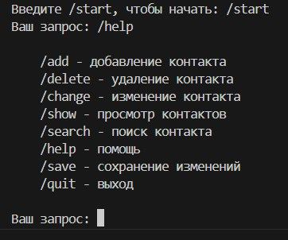
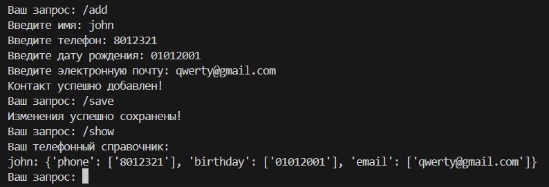

# Что такое Phonebook?

**Phonebook** - *консольное приложение*, позволяющее хранить некоторые данные о человеке, включая номер телефона, а проще говоря - [телефонная книга](https://ru.wikipedia.org/wiki/%D0%A2%D0%B5%D0%BB%D0%B5%D1%84%D0%BE%D0%BD%D0%BD%D1%8B%D0%B9_%D1%81%D0%BF%D1%80%D0%B0%D0%B2%D0%BE%D1%87%D0%BD%D0%B8%D0%BA)

# Какие возможности у Phonebook?
**Phonebook** позволяет *добавлять, удалять, изменять и отслеживать* данные, делая его незаменимым помощником для персон, постоянно работающих с  людьми

# В чем достоинства Phonebook?

**Phonebook** имеет *максимально простой интерфейс* (консоль), позволяющий не тратить ресурсы вашего устройства, интуитивно понятные *команды* и *подсказки*

Пользуйтесь **Phonebook**!